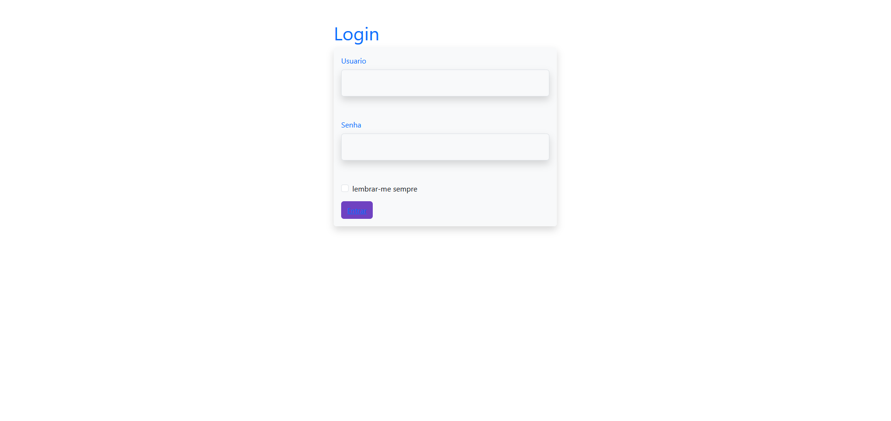
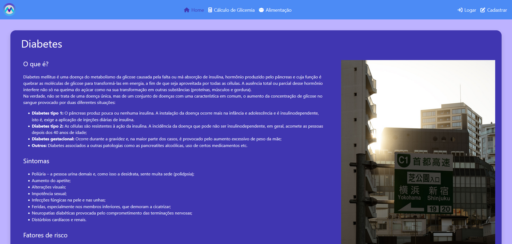
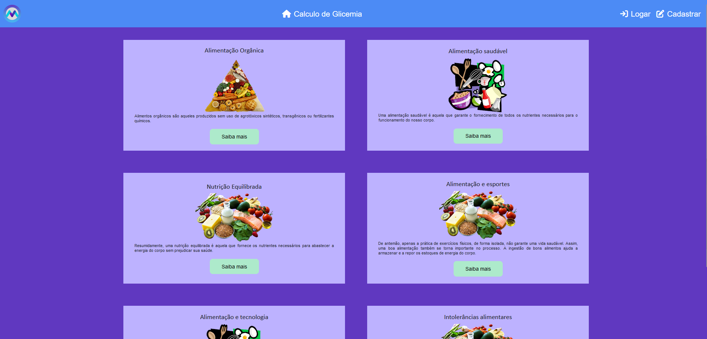
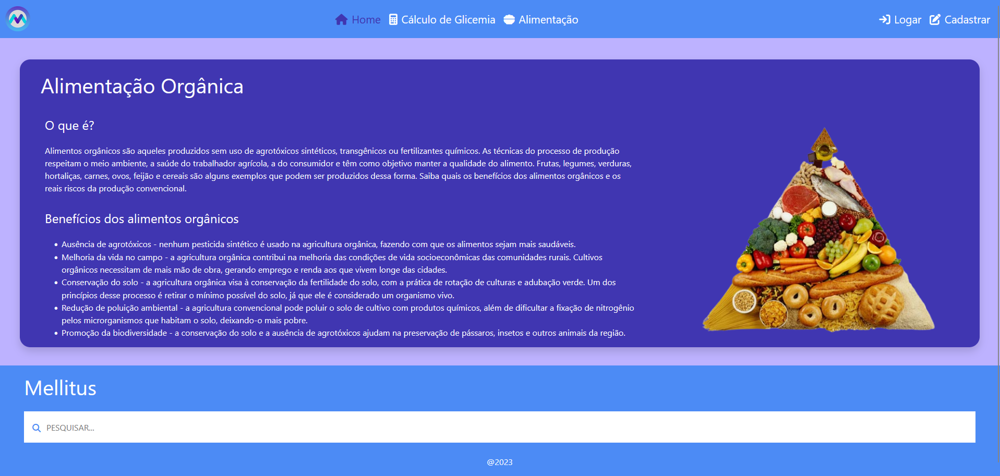
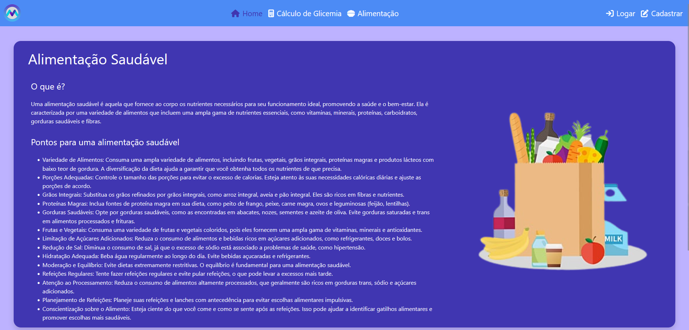
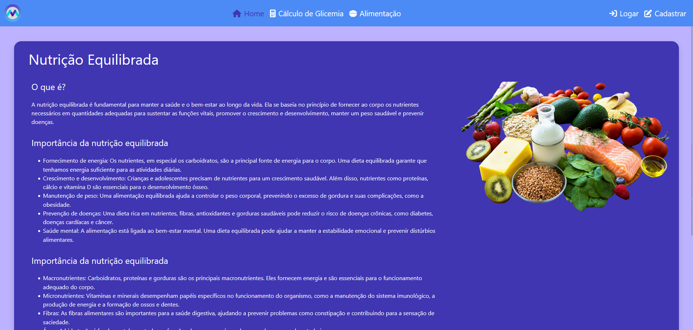
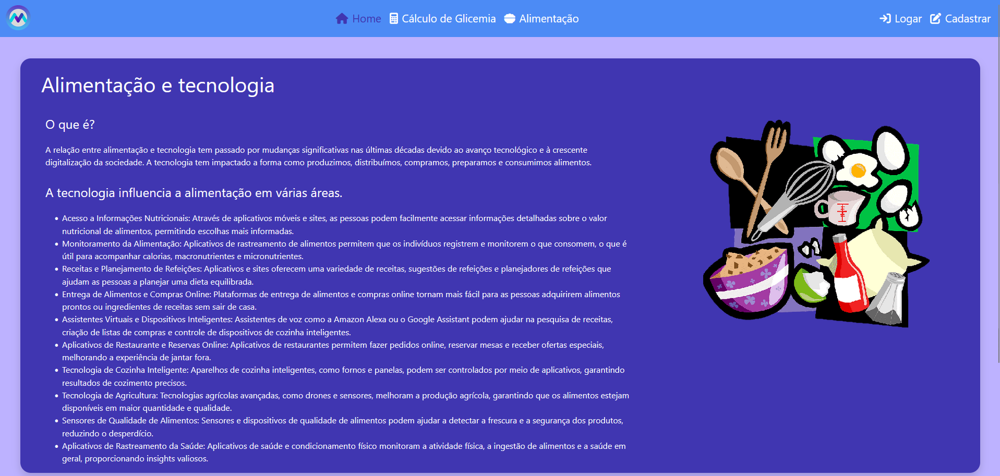
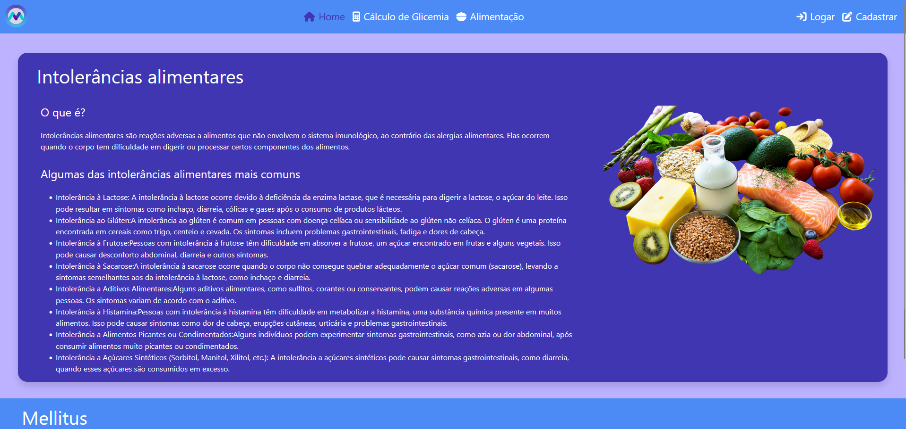
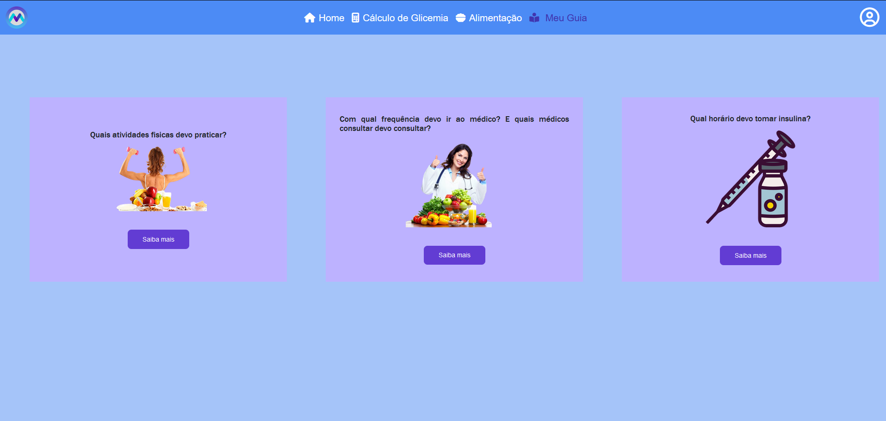
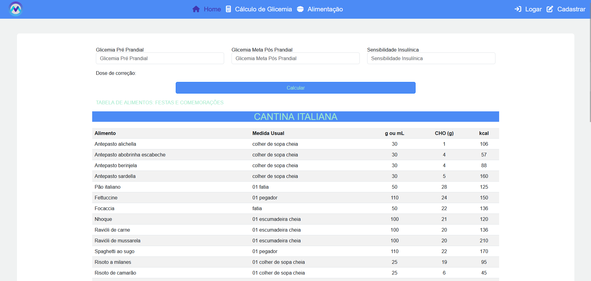

# Programação de Funcionalidades

Implementação do sistema descritas por meio dos requisitos funcionais e/ou não funcionais. Deve relacionar os requisitos atendidos os artefatos criados (código fonte) além das estruturas de dados utilizadas e as instruções para acesso e verificação da implementação que deve estar funcional no ambiente de hospedagem.

## Tela de login

## Home page

## Home page Loged

## Tela principal de alimentação

## Tópico Alimentação orgânica

## Tópico Alimentação saudável

## Tópico Alimentação equilibrada

## Tópico Alimentação e esportes

## Tópico Alimentação e tecnologia

## Tópico Intolerância alimentares

## Tela principal de Meu guia

## Guia esportes

## Guia especialistas

## Guia insulina

## Tela de cálculo de glícemia

## Requisitos Atendidos

As tabelas que se seguem apresentam os requisitos funcionais e não-funcionais que relacionam o escopo do projeto com os artefatos criados:

### Requisitos Funcionais

| ID    | Descrição do Requisito                                    | Prioridade | Artefato Criado         |
|-------|-----------------------------------------------------------|------------|-------------------------|
| RF-001| Criação do cadastro de usuário.                              | ALTA       | login.html              |
| RF-002| Página principal do sistema.      | ALTA       | HomePage.html           |
| RF-003| Página principal do sistema, porém para usuários já cadastrados.      | ALTA       | HomePageLoged.html      |
| RF-004| Dicas de alimentação.      | ALTA       | Alimentacao.html        |
| RF-005| Calculadora de correção de dose glicêmica.      | ALTA       | CalculoGlicemia.html    |
| RF-006| Dicas de alimentação saudável.      | ALTA       | AlimentacaoSaudavel.html |
| RF-007| Dicas de alimentação esportiva.      | ALTA       | AlimentacaoeEsportes.html|
| RF-008| Dicas de alimentação e suas tecnologias.      | ALTA       | AlimentacaoeTecnologia.html|
| RF-009| Dicas de alimentos orgânicos.      | ALTA       | AlimentosOrganicos.html |
| RF-010| Informativo de intolerância alimentar.            | ALTA       | IntoleranciaAlimentar.html|
| RF-011| Navegação entre páginas do Meu Guia.                     | ALTA       | MeuGuia.html            |
| RF-012| Registro Meu Guia Física.               | ALTA       | MeuGuiaFisica.html       |
| RF-013| Registro Meu Guia Frequência.           | ALTA       | MeuGuiaFrequencia.html   |
| RF-014| Registro Meu Guia Insulina.             | ALTA       | MeuGuiaInsulina.html     |
| RF-015| Correção do path para login e login homepage loged.      | ALTA       | NutricaoEquilibrada.html |
